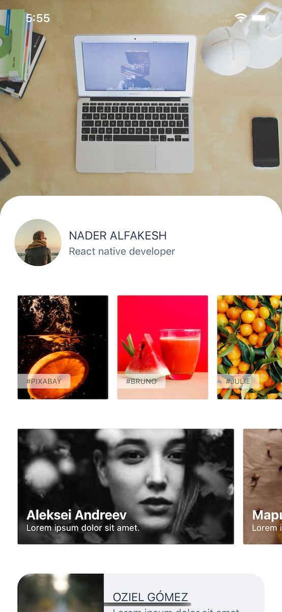

# React native dealing with images loading, viewing, zooming, and caching

This repo is a demo project for an article on dev.to explaining how to deal with images in react native

[Go to the article](https://dev.to/naderalfakesh/building-reusable-image-components-for-react-native-3iah-temp-slug-4684821?preview=0309aa4b5f0b61a90b3db402d8f0607a962a47992f2383188aa7910c9325407c94959a67145574774d6c96d44791813f07208950ef1993cb4b0bc398)

You may notice a lot of not used things in this repo and that's because I like trying different things every time.
This time I wanted to checkout infinite red ignite boilerplate (amazing btw).

All you need to check is the app/components folder which has all the components written with typescript and storybook stories as well.

<p align="center">

</p>

## Installing and running the project locally

- clone this repo to your computer
- install all the packages by running the folowing in the terminal.

```
yarn install
cd ios && pod install && cd ..
```

- run react native with simulator `yarn ios`

## Running Storybook

From the command line in your generated app's root directory, enter `yarn run storybook`
This starts up the storybook server and opens a story navigator in your browser. With your app
running, choose Toggle Storybook from the developer menu to switch to Storybook; you can then
use the story navigator in your browser to change stories.


